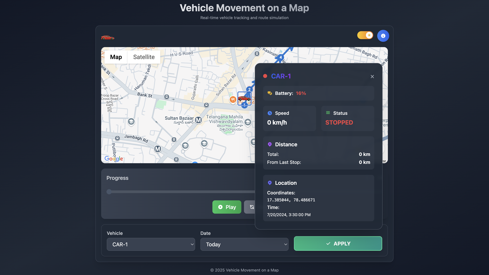

# Vehicle Movement on a Map

A frontend-only React app that simulates a vehicle moving on a map using dummy data.

## Features

- Map with route polyline and animated vehicle marker
- Play/Pause/Reset controls
- Displays current coordinate, timestamp, elapsed time, and speed
- Responsive UI (works on desktop & mobile)

## Tech Stack

- React + Vite + TypeScript
- Google Maps (via @react-google-maps/api)
- Tailwind CSS

## Setup

1. **Install dependencies:**
   ```bash
   npm install
   ```

2. **Run the app locally:**
   ```bash
   npm run dev
   ```

3. **Build for production:**
   ```bash
   npm run build
   ```

4. **Preview production build:**
   ```bash
   npm run preview
   ```

## Deployment

- Deploy the `dist/` folder to Vercel, Netlify, or GitHub Pages.
- For Vercel/Netlify: just connect your repo and deploy!

## Dummy Data

Edit `src/dummy-route.json` to change the route.

## Screenshot



---

## License

MIT

